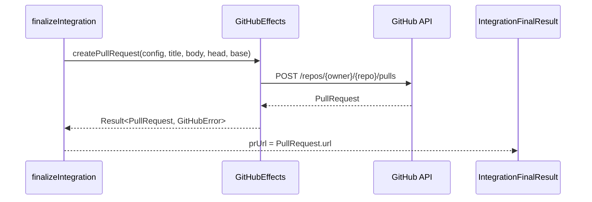

# GitHub 連携設計（案）

## 目的

- GitHub 上の PR 作成、チェック/ステータス更新、ワークフローディスパッチを行うための設計指針を定義する
- Orchestrator の `finalizeIntegration` から `IntegrationFinalResult.prUrl` に至るデータフローを明確化する

## スコープ

- 対象: GitHub API 連携（REST/GraphQL は実装側で判断）
- 非対象: OAuth フロー、Webhook 受信サーバ、PR コメント bot、Issue 管理

## アダプタ配置とインターフェース方針

- 配置: `src/adapters/github/` 配下に GitHub アダプタを配置する
- 返り値統一: **すべての GitHubEffects メソッドは `option-t` の `Result<T, GitHubError>` を返す**
- 呼び出し側は `Result` を前提にエラーハンドリング（`map/andThen` または `unwrapOr`）を行う

### GitHubEffects インターフェース案

```ts
import type { Result } from 'option-t/result';
import type {
  GitHubConfig,
  PullRequest,
  CheckRun,
  Status,
  WorkflowDispatchInput,
  WorkflowDispatchResult,
  GitHubError,
} from '../types/github.ts';

export interface GitHubEffects {
  createPullRequest(input: {
    config: GitHubConfig;
    title: string;
    body: string;
    head: string;
    base: string;
    draft?: boolean;
  }): Result<PullRequest, GitHubError>;

  findPullRequestByHead(input: {
    config: GitHubConfig;
    head: string;
  }): Result<PullRequest | null, GitHubError>;

  createCheckRun(input: {
    config: GitHubConfig;
    check: CheckRun;
  }): Result<CheckRun, GitHubError>;

  createStatus(input: {
    config: GitHubConfig;
    status: Status;
  }): Result<Status, GitHubError>;

  dispatchWorkflow(input: WorkflowDispatchInput): Result<WorkflowDispatchResult, GitHubError>;
}
```

## データモデル

### GitHubConfig

- `owner`: リポジトリ所有者
- `repo`: リポジトリ名
- `auth`:
  - **ポリシー**: トークンは「環境変数 or 秘密ストア参照」のみを許可し、平文保存は避ける
  - 実装例: `auth: { kind: 'env', envName: 'GITHUB_TOKEN' }` など

### PullRequest

- 入力: `title`, `body`, `head`, `base`, `draft?`
- 出力/保持: `id`, `number`, `url`, `state`, `merged`, `headRef`, `baseRef`, `createdAt`, `updatedAt`

### CheckRun / Status

- **CheckRun**
  - 入力/保持: `name`, `headSha`, `status`, `conclusion?`, `detailsUrl?`, `startedAt?`, `completedAt?`, `output?`
  - `output`: `title`, `summary`, `text?`, `annotations?`
- **Status**
  - 入力/保持: `state`, `context`, `description?`, `targetUrl?`, `sha`

### WorkflowDispatch

- **入力**: `config`, `workflowId`（または `workflowFile`）, `ref`, `inputs`（key/value）
- **出力**: `accepted`（boolean）, `requestedAt`, `trackingUrl?`

## エラーモデル

- `src/types/errors.ts` に **`GitHubError` を追加**する計画
- 種別（例）:
  - `GitHubAuthFailed`（認証失敗）
  - `GitHubRateLimited`（レート制限）
  - `GitHubNotFound`（Repo/PR/Workflow など未存在）
  - `GitHubCommandFailed`（API 呼び出し失敗、HTTP 5xx 等）
  - `GitHubValidationError`（入力不正）
  - `GitHubConflict`（マージ競合など）
  - `GitHubUnknownError`（想定外）

## データフロー（finalizeIntegration → prUrl）

### 手順

1. `finalizeIntegration` が `GitHubConfig` と PR 作成情報を組み立てる
2. `GitHubEffects.createPullRequest` を呼び出し、`Result<PullRequest, GitHubError>` を受け取る
3. 成功時: `PullRequest.url` を `IntegrationFinalResult.prUrl` に格納
4. 失敗時: `GitHubError` を上位へ返し、最終結果にはエラー情報を反映

### Mermaid



## セキュリティ

- **トークンをログ出力しない**（リクエスト/レスポンスのログにも含めない）
- **設定ファイルへの平文保存を避ける**（環境変数参照 or OS 秘密ストアを前提）
- 例外メッセージにトークン断片を含めない
- 監視/トレース時はトークンをマスクする

## エッジケースと扱い

- **リモート無し**: 事前に検出し、`GitHubNotFound` 相当で早期終了
- **トークン未設定**: 起動時に検証し、`GitHubAuthFailed` として返却
- **PR 重複**: `findPullRequestByHead` で既存確認し、存在時は URL を再利用する
- **レート制限**: `GitHubRateLimited` を返し、上位がリトライ方針を決定
- **マージ競合**: `GitHubConflict` として返し、手動解消を促す

## 実装しないこと（明記）

- OAuth 認可フロー
- Webhook 受信/イベント駆動
- GitHub App の鍵管理
- Actions ランの完了待ち（追跡は `trackingUrl` まで）

## テスト方針

- **ユニット**: `GitHubEffects` の引数検証/変換/エラー分類のテスト
- **統合**: GitHub のテスト用リポジトリで API 呼び出し結果を確認
- **手動検証**: 実際に PR 作成 → prUrl 反映 → CheckRun/Status 更新を確認
