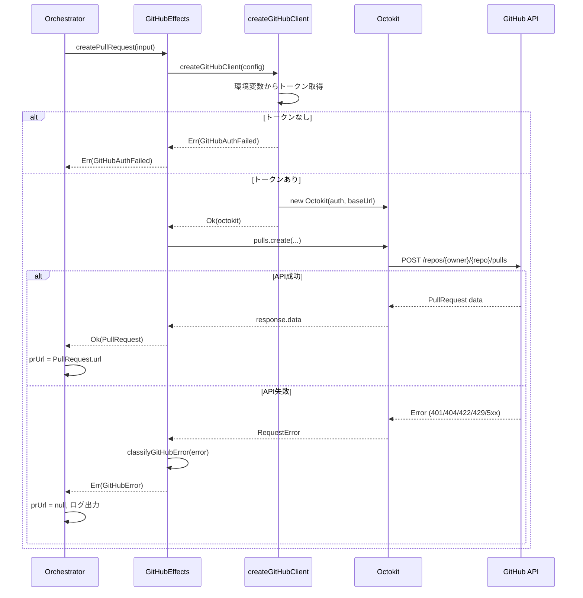

# GitHub連携 実装計画（フェーズ1: PR作成）

## 決定事項サマリー

本ドキュメントは、以下の設計ドキュメントに基づき、ユーザーとの質疑応答を通じて決定した実装方針をまとめたものです。

- 参照元:
  - `docs/plans/github-integration.md`
  - `docs/plans/github-integration-plan.md`
  - `docs/plans/github-integration-design.md`

### スコープと方針

| 項目             | 決定内容                                      | 理由                                            |
| ---------------- | --------------------------------------------- | ----------------------------------------------- |
| **実装フェーズ** | フェーズ1のみ（PR作成）                       | 最小構成で早期動作確認                          |
| **認証方式**     | PAT（Personal Access Token）のみ              | 個人開発・検証環境向け、実装がシンプル          |
| **API種類**      | REST API                                      | Octokitライブラリが充実、エラーハンドリング明確 |
| **既存PR検出**   | 実装しない                                    | 新規PR作成のみ、既存PR時はエラー                |
| **ライブラリ**   | Octokit                                       | GitHub公式、型安全性、自動レート制限処理        |
| **レート制限**   | エラーとして返す                              | フェーズ1では単純に失敗、リトライは将来対応     |
| **設定ファイル** | `.agent/config.json`に統合                    | 既存設定と一元管理                              |
| **実装順序**     | 型定義 → アダプタ → 統合                      | インターフェース先行で明確化                    |
| **エラー種別**   | 4種（認証失敗、レート制限、未存在、入力不正） | フェーズ1で必要最小限                           |

---

## 実装スコープ

### 含まれるもの

- ✅ GitHub PAT認証の設定読み込み
- ✅ PR作成APIの呼び出し（Octokit REST API使用）
- ✅ PR URLの取得と`IntegrationFinalResult.prUrl`への格納
- ✅ エラー種別の分類（認証失敗、レート制限、リポジトリ未存在、入力不正）
- ✅ `option-t` の `Result<T, E>` 型を使ったエラーハンドリング

### 含まれないもの（将来対応）

- ❌ GitHub App認証
- ❌ 既存PRの検出・更新
- ❌ PR/Issueコメント投稿
- ❌ CheckRun/Statusの記録
- ❌ Actions結果参照
- ❌ レート制限時の自動リトライ
- ❌ GraphQL API

---

## 実装ファイルと責務

### 新規作成ファイル

```
src/
├── adapters/
│   └── github/
│       ├── index.ts                # GitHubEffectsインターフェースとエクスポート
│       ├── client.ts               # Octokitクライアント生成・認証
│       ├── pull-request.ts         # PR作成の実装
│       └── error.ts                # GitHubエラー型とエラー分類ロジック
├── types/
│   └── github.ts                   # GitHub関連の型定義
└── core/
    └── orchestrator/
        └── integration-operations.ts  # 既存、PR作成TODO箇所を実装
```

### 既存ファイルの修正

- `src/types/config.ts`: `github`セクションの型定義追加
- `src/types/errors.ts`: `GitHubError`バリアントの追加
- `src/types/integration.ts`: 既存（`IntegrationFinalResult.prUrl`は定義済み）

---

## 型定義設計

### `src/types/github.ts`

```typescript
import type { Result } from 'option-t/result';

/**
 * GitHub設定（.agent/config.jsonのgithubセクション）
 */
export interface GitHubConfig {
  /** APIベースURL（デフォルト: https://api.github.com） */
  apiBaseUrl: string;
  /** リポジトリ所有者（org or user） */
  owner: string;
  /** リポジトリ名 */
  repo: string;
  /** 認証設定 */
  auth: GitHubAuthConfig;
}

/**
 * GitHub認証設定（フェーズ1: PATのみ）
 */
export interface GitHubAuthConfig {
  /** 認証タイプ */
  type: 'pat';
  /** 環境変数名（例: GITHUB_TOKEN） */
  tokenEnvName: string;
}

/**
 * PR作成入力
 */
export interface CreatePullRequestInput {
  config: GitHubConfig;
  /** PRタイトル */
  title: string;
  /** PR本文 */
  body: string;
  /** ソースブランチ（head） */
  head: string;
  /** ターゲットブランチ（base） */
  base: string;
  /** ドラフトPRとして作成するか */
  draft?: boolean;
}

/**
 * PR情報（API応答）
 */
export interface PullRequest {
  /** PR ID */
  id: number;
  /** PR番号 */
  number: number;
  /** PR URL */
  url: string;
  /** PRの状態 */
  state: 'open' | 'closed';
  /** headブランチ */
  headRef: string;
  /** baseブランチ */
  baseRef: string;
  /** 作成日時 */
  createdAt: string;
  /** 更新日時 */
  updatedAt: string;
}

/**
 * GitHubEffectsインターフェース（フェーズ1: PR作成のみ）
 */
export interface GitHubEffects {
  /**
   * Pull Requestを作成する
   */
  createPullRequest(input: CreatePullRequestInput): Promise<Result<PullRequest, GitHubError>>;
}
```

### `src/types/errors.ts`への追加

```typescript
/**
 * GitHubエラーの種別
 */
export type GitHubError =
  | GitHubAuthFailed
  | GitHubRateLimited
  | GitHubNotFound
  | GitHubValidationError
  | GitHubUnknownError;

/**
 * 認証失敗（トークン未設定、無効なトークン）
 */
export interface GitHubAuthFailed {
  kind: 'GitHubAuthFailed';
  message: string;
  /** 環境変数名が未設定の場合に記録 */
  missingEnvName?: string;
}

/**
 * レート制限到達
 */
export interface GitHubRateLimited {
  kind: 'GitHubRateLimited';
  message: string;
  /** リセット時刻（UNIX timestamp） */
  resetAt?: number;
  /** 残りリクエスト数 */
  remaining?: number;
}

/**
 * リポジトリ未存在
 */
export interface GitHubNotFound {
  kind: 'GitHubNotFound';
  message: string;
  /** 見つからなかったリソース種別 */
  resourceType: 'repository' | 'branch' | 'pullRequest';
}

/**
 * 入力検証エラー
 */
export interface GitHubValidationError {
  kind: 'GitHubValidationError';
  message: string;
  /** 検証失敗したフィールド */
  field?: string;
}

/**
 * 予期しないGitHubエラー
 */
export interface GitHubUnknownError {
  kind: 'GitHubUnknownError';
  message: string;
  /** HTTPステータスコード */
  statusCode?: number;
  /** 元のエラーメッセージ */
  originalError?: string;
}
```

### `src/types/config.ts`への追加

```typescript
import type { GitHubConfig } from './github.ts';

export interface AgentConfig {
  // ... 既存フィールド
  /**
   * GitHub連携設定（オプショナル）
   */
  github?: GitHubConfig;
}
```

---

## GitHubアダプタ設計

### `src/adapters/github/client.ts`

```typescript
import { Octokit } from '@octokit/rest';
import type { GitHubConfig } from '../../types/github.ts';
import { createErr, createOk, type Result } from 'option-t/result';
import type { GitHubError } from '../../types/errors.ts';

/**
 * Octokitクライアントを生成する
 */
export function createGitHubClient(config: GitHubConfig): Result<Octokit, GitHubError> {
  // 環境変数からトークンを取得
  const token = process.env[config.auth.tokenEnvName];

  if (!token) {
    return createErr({
      kind: 'GitHubAuthFailed',
      message: `環境変数 ${config.auth.tokenEnvName} が設定されていません`,
      missingEnvName: config.auth.tokenEnvName,
    });
  }

  const octokit = new Octokit({
    auth: token,
    baseUrl: config.apiBaseUrl,
  });

  return createOk(octokit);
}
```

### `src/adapters/github/pull-request.ts`

```typescript
import type { Octokit } from '@octokit/rest';
import type { CreatePullRequestInput, PullRequest } from '../../types/github.ts';
import { createErr, createOk, type Result } from 'option-t/result';
import type { GitHubError } from '../../types/errors.ts';
import { classifyGitHubError } from './error.ts';

/**
 * Pull Requestを作成する
 */
export async function createPullRequest(
  octokit: Octokit,
  input: CreatePullRequestInput,
): Promise<Result<PullRequest, GitHubError>> {
  try {
    const response = await octokit.rest.pulls.create({
      owner: input.config.owner,
      repo: input.config.repo,
      title: input.title,
      body: input.body,
      head: input.head,
      base: input.base,
      draft: input.draft ?? false,
    });

    const data = response.data;

    const pullRequest: PullRequest = {
      id: data.id,
      number: data.number,
      url: data.html_url,
      state: data.state as 'open' | 'closed',
      headRef: data.head.ref,
      baseRef: data.base.ref,
      createdAt: data.created_at,
      updatedAt: data.updated_at,
    };

    return createOk(pullRequest);
  } catch (error) {
    return createErr(classifyGitHubError(error));
  }
}
```

### `src/adapters/github/error.ts`

```typescript
import type { GitHubError } from '../../types/errors.ts';

/**
 * Octokit/GitHub APIエラーを分類する
 */
export function classifyGitHubError(error: unknown): GitHubError {
  // Octokit RequestErrorの型ガード
  if (error && typeof error === 'object' && 'status' in error && typeof error.status === 'number') {
    const statusCode = error.status;
    const message =
      'message' in error && typeof error.message === 'string' ? error.message : 'Unknown error';

    // 認証失敗
    if (statusCode === 401 || statusCode === 403) {
      return {
        kind: 'GitHubAuthFailed',
        message: `認証に失敗しました: ${message}`,
      };
    }

    // レート制限
    if (statusCode === 429) {
      let resetAt: number | undefined;
      let remaining: number | undefined;

      if (
        'response' in error &&
        error.response &&
        typeof error.response === 'object' &&
        'headers' in error.response
      ) {
        const headers = error.response.headers as Record<string, string>;
        resetAt = headers['x-ratelimit-reset']
          ? parseInt(headers['x-ratelimit-reset'], 10)
          : undefined;
        remaining = headers['x-ratelimit-remaining']
          ? parseInt(headers['x-ratelimit-remaining'], 10)
          : undefined;
      }

      return {
        kind: 'GitHubRateLimited',
        message: `レート制限に達しました: ${message}`,
        resetAt,
        remaining,
      };
    }

    // リソース未存在
    if (statusCode === 404) {
      return {
        kind: 'GitHubNotFound',
        message: `リソースが見つかりません: ${message}`,
        resourceType: 'repository', // デフォルト
      };
    }

    // 入力検証エラー
    if (statusCode === 422) {
      return {
        kind: 'GitHubValidationError',
        message: `入力が不正です: ${message}`,
      };
    }

    // その他のエラー
    return {
      kind: 'GitHubUnknownError',
      message: `予期しないエラーが発生しました: ${message}`,
      statusCode,
      originalError: message,
    };
  }

  // 型不明のエラー
  return {
    kind: 'GitHubUnknownError',
    message: `予期しないエラーが発生しました: ${String(error)}`,
    originalError: String(error),
  };
}
```

### `src/adapters/github/index.ts`

```typescript
import type { GitHubEffects } from '../../types/github.ts';
import { createGitHubClient } from './client.ts';
import { createPullRequest as createPR } from './pull-request.ts';
import { andThen } from 'option-t/result';

/**
 * GitHubEffectsの実装
 */
export const githubEffects: GitHubEffects = {
  async createPullRequest(input) {
    // クライアント生成 → PR作成
    const clientResult = createGitHubClient(input.config);
    return andThen(clientResult, (octokit) => createPR(octokit, input));
  },
};
```

---

## Orchestrator統合

### `src/core/orchestrator/integration-operations.ts`

既存の`finalizeIntegration`関数内で、PR作成処理を実装します。

```typescript
import { githubEffects } from '../../adapters/github/index.ts';
import { unwrapOrElse } from 'option-t/result';
import type { GitHubConfig } from '../../types/github.ts';
import type { IntegrationFinalResult } from '../../types/integration.ts';

export async function finalizeIntegration(
  config: AgentConfig,
  // ... 他のパラメータ
): Promise<IntegrationFinalResult> {
  // ... 既存の処理

  // GitHub連携が設定されている場合、PR作成
  if (config.github && config.integration?.method === 'pull-request') {
    const githubConfig: GitHubConfig = config.github;

    const prResult = await githubEffects.createPullRequest({
      config: githubConfig,
      title: `${taskName} - Agent Orchestrator`,
      body: generatePRBody(/* ... */),
      head: currentBranch,
      base: config.integration.baseBranch ?? 'main',
      draft: false,
    });

    const prUrl = unwrapOrElse(prResult, (error) => {
      // エラー時はログ出力し、prUrlはnullのまま
      console.error(`PR作成に失敗しました: ${error.kind} - ${error.message}`);
      return null;
    });

    return {
      // ... 既存のフィールド
      prUrl: prUrl?.url ?? null,
    };
  }

  // GitHub連携なしの場合
  return {
    // ... 既存のフィールド
    prUrl: null,
  };
}
```

---

## 設定スキーマ

### `.agent/config.json`の例

```json
{
  "integration": {
    "method": "pull-request",
    "baseBranch": "main"
  },
  "github": {
    "apiBaseUrl": "https://api.github.com",
    "owner": "your-org-or-user",
    "repo": "your-repo",
    "auth": {
      "type": "pat",
      "tokenEnvName": "GITHUB_TOKEN"
    }
  }
}
```

### 環境変数

```bash
export GITHUB_TOKEN="ghp_your_personal_access_token_here"
```

---

## データフロー



---

## エラーハンドリング

### エラー種別と対応

| エラー種別              | 発生タイミング             | HTTPステータス | 対応方針                                     |
| ----------------------- | -------------------------- | -------------- | -------------------------------------------- |
| `GitHubAuthFailed`      | トークン未設定、認証失敗   | 401, 403       | ログ出力、`prUrl=null`                       |
| `GitHubRateLimited`     | レート制限到達             | 429            | ログ出力、`prUrl=null`（リトライは将来対応） |
| `GitHubNotFound`        | リポジトリ・ブランチ未存在 | 404            | ログ出力、`prUrl=null`                       |
| `GitHubValidationError` | PR作成パラメータ不正       | 422            | ログ出力、`prUrl=null`                       |
| `GitHubUnknownError`    | その他のエラー             | 5xx等          | ログ出力、`prUrl=null`                       |

### エラー時の挙動

- フェーズ1では**PR作成失敗時でもOrchestrator全体は継続**する
- `IntegrationFinalResult.prUrl` は `null` となる
- エラー詳細はコンソールログに出力し、後続処理に影響を与えない
- 将来のフェーズでリトライ機構を追加する可能性を考慮

---

## 実装順序

### ステップ1: 型定義

- [ ] `src/types/github.ts` を作成
- [ ] `src/types/errors.ts` に `GitHubError` バリアントを追加
- [ ] `src/types/config.ts` に `github?` フィールドを追加

### ステップ2: GitHubアダプタ

- [ ] `src/adapters/github/error.ts` を作成（エラー分類）
- [ ] `src/adapters/github/client.ts` を作成（Octokitクライアント生成）
- [ ] `src/adapters/github/pull-request.ts` を作成（PR作成実装）
- [ ] `src/adapters/github/index.ts` を作成（`GitHubEffects`実装）

### ステップ3: Orchestrator統合

- [ ] `src/core/orchestrator/integration-operations.ts` 内の `finalizeIntegration` を修正
- [ ] PR作成呼び出し、エラーハンドリング、`prUrl` 格納を実装

### ステップ4: テスト

- [ ] ユニットテスト: `error.ts` のエラー分類ロジック
- [ ] 統合テスト: 実際のGitHubリポジトリでPR作成を確認（手動）
- [ ] エラーケーステスト: トークン未設定、不正なリポジトリ名などを検証

---

## テスト方針

### ユニットテスト

- **対象**: `src/adapters/github/error.ts` の `classifyGitHubError`
- **ツール**: `node:test` + `node:assert`
- **カバー範囲**:
  - 401/403 → `GitHubAuthFailed`
  - 429 → `GitHubRateLimited`
  - 404 → `GitHubNotFound`
  - 422 → `GitHubValidationError`
  - その他 → `GitHubUnknownError`

### 統合テスト（手動検証）

- **前提**: テスト用GitHubリポジトリを用意
- **手順**:
  1. `.agent/config.json` にGitHub設定を記述
  2. `GITHUB_TOKEN` 環境変数を設定
  3. Orchestratorを実行し、PR作成を確認
  4. `IntegrationFinalResult.prUrl` にPR URLが格納されることを確認

### エラーケーステスト

- **トークン未設定**: `GITHUB_TOKEN` を設定せず実行 → `GitHubAuthFailed`
- **不正なリポジトリ**: 存在しない `owner/repo` を指定 → `GitHubNotFound`
- **不正なブランチ**: 存在しない `head` ブランチを指定 → `GitHubValidationError` または `GitHubNotFound`

---

## セキュリティ

### トークン管理

- **環境変数のみ**: `.agent/config.json` には `tokenEnvName` のみを記録
- **平文保存禁止**: トークンそのものは設定ファイルに含めない
- **ログマスク**: トークンをログ出力しない（Octokitが自動でマスク）

### 権限最小化

- **必要な権限**（PAT）:
  - `repo`（プライベートリポジトリの場合）
  - または `public_repo`（パブリックリポジトリの場合）

---

## 依存関係

### 追加するnpmパッケージ

```bash
pnpm add @octokit/rest
pnpm add -D @types/node  # 既存の場合は不要
```

### 既存依存

- `option-t`: 既に使用中（`Result<T, E>` 型）

---

## 将来の拡張ポイント

### フェーズ2（PR管理・コメント）

- `findPullRequestByHead`: 既存PR検出
- `updatePullRequest`: PR本文・ラベル更新
- `createComment`: コメント投稿

### フェーズ3（Checks/Actions）

- `createCheckRun`: Judge結果をCheckRunとして記録
- `listWorkflowRuns`: PRに紐づくActions結果取得

### GitHub App対応

- `GitHubAuthConfig.type = 'app'`
- JWT生成、Installation Token取得
- `src/adapters/github/auth.ts` を追加

---

## 参考リンク

- [Octokit REST API](https://octokit.github.io/rest.js/)
- [GitHub REST API - Pulls](https://docs.github.com/en/rest/pulls/pulls)
- [option-t Documentation](https://github.com/option-t/option-t)

---

## 変更履歴

- **2026-01-19**: 初版作成（フェーズ1: PR作成のみ）
